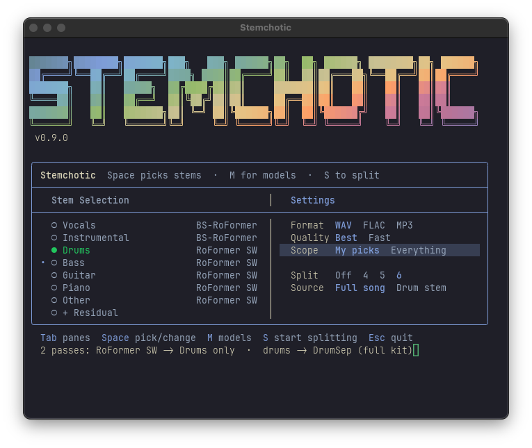

# Stemchotic

A dead-simple stem separator. Pick what you want out of a track ("vocals", "instrumental", "drums", "drumset pieces", "bass", "guitar", "piano", "other") and Stemchotic picks the right model for you and runs it. No 40-item dropdown of cryptic model names.

It's a thin, opinionated TUI on top of
[python-audio-separator](https://github.com/karaokenerds/python-audio-separator),
which does the actual separation using models from
[Ultimate Vocal Remover](https://github.com/Anjok07/ultimatevocalremovergui),
Demucs, and the BS-RoFormer family.



#### [Download](https://github.com/noahbaxter/stemchotic/releases/latest) now for macOS, Windows, and Linux.

## Status

Stemchotic is currently in Beta on macOS, Windows, and Linux with all primary features functional.

- Pick the parts you want (up to 7: vocals, instrumental, drums, bass, guitar, piano, other). Stemchotic picks a strong default model for each, but you're welcome to pick your own whenever you like.
- Drum-kit splitting into kick / snare / toms / cymbals (4/5/6-piece).
- Routes to strong open models (BS-RoFormer, DrumSep, Demucs) and sets up GPU-acceleration if your hardware would benefit from it.
- Interactive TUI or one-line CLI; WAV / FLAC / MP3, output saved next to your file.

## Install

Go to the [latest release](https://github.com/noahbaxter/stemchotic/releases/latest),
open the **Assets** list, and download the file for your computer:

**macOS** (Apple Silicon)
1. Download `Stemchotic.dmg`.
2. Double-click it. In the window that opens, drag the **Stemchotic** icon onto the **Applications** folder.
3. Open **Stemchotic** from Applications (or Launchpad).

**Windows 10/11**
1. Download `stemchotic.exe`.
2. Double-click it. Windows will say "Windows protected your PC", that's normal for a new app: click **More info**, then **Run anyway**.

**Linux**
1. Download `stemchotic`, mark it executable, and run it from a terminal.

The first launch sets everything up for you (it downloads Python and the audio
engine, about 1-2.5 GB depending on your hardware), so give it a few minutes. After that it should open in seconds. Separation models automatically download the first time you use each one (roughly 50-670 MB apiece) and are cached afterward. The model list comes from python-audio-separator, with a `models.json` overlay in this repo adding curated quality rankings and a few open-weight extras (DrumSep, BS-Roformer-SW); each model is pulled from its public host (the UVR repo, or the authors' repos) on first use.

## Using it

1. Open Stemchotic (double-click it).
2. Scroll the part list and press **Space** to pick each stem you want.
3. Press **S** to start.
4. Type the path to your audio file, or just drag the file onto the window.
5. Stemchotic separates the stems, names them clearly, and drops them in the same folder as the original.

That's the whole loop. If you want more control: the window has two panes, **Tab**
switches between **Stem Selection** (left) and **Settings** (right). Each highlighted
stem shows the model it'll use, and the line under the box is the live plan. **M**
opens the Models screen, **S** opens the drum-kit split. Settings cover **Quality**
(Best / Fast), **Scope** (just your picks vs everything the models make), **Drum kit**
(4/5/6-piece, from a song or an existing drum stem), and output format.

### Maintenance flags

| Flag | What it does |
|---|---|
| `--clean` | Reinstalls the app and env; asks before touching downloaded models |
| `--setup` | Re-runs the hardware/GPU question |
| `--offline` | Skips the update check and launches from the local install |
| `--uninstall` | Removes everything it installed (cache, state, logs, menu entry); leaves the launcher |

## Command line

For scripting and power users (run from a source checkout; the installed launcher
binary accepts the same arguments). Pass a preset and/or an audio file, plus flags:

```sh
python stemchotic.py                     # interactive picker
python stemchotic.py drums song.wav -y   # a preset, headless
python stemchotic.py --list              # list presets
```

**Presets:**

| Key | Does |
|---|---|
| `vocals` | Vocals + Instrumental (BS-RoFormer) |
| `instrumental` | Instrumental only |
| `band` | Drums, Bass, Vocals, Guitar, Piano, Other (Drums/Bass via HTDemucs, others via BS-Roformer-SW, vocals via RoFormer) |
| `drums` | Drums, single file |
| `bass` | Bass, single file |
| `kit` | Drums + 5-piece DrumSep cascade (kick/snare/toms/hh/cymbals) |
| `kit4` | Drums + 4-piece cascade (hh merged into cymbals) |
| `kit6` | Drums + 6-piece cascade (kick/snare/toms/hh/ride/crash) |
| `kitsplit` | Input is already a drum stem: DrumSep it directly, no extraction |

**Flags** (override the preset, or skip presets with `--stems`):

| Flag | What it does |
|---|---|
| `--stems S1,S2,...` | Explicit selection (Vocals/Instrumental/Drums/Bass/Guitar/Piano/Other); overrides the preset |
| `--quality best\|fast` | Model tier (default best) |
| `--format wav\|flac\|mp3` | Output format (default wav) |
| `--all` | Keep everything the models make (forces residual off) |
| `--residual` | Also write `[Residual]` = mix minus your picks |
| `--split off\|4\|5\|6` | Drum-kit split |
| `--source song\|stem` | Treat the input as a full song or an existing drum stem |
| `-y`, `--yes` | Skip per-model download prompts |

## From source

The TUI toolkit lives in the [chotic-ui](https://github.com/noahbaxter/chotic-ui)
submodule, so clone with submodules (or init them after):

```sh
git clone --recurse-submodules https://github.com/noahbaxter/stemchotic
# already cloned? -> git submodule update --init

python3 -m venv .venv && source .venv/bin/activate
pip install -r requirements.txt    # installs audio-separator + the chotic-ui submodule (editable)
```

On Apple Silicon this pulls `audio-separator[cpu]` (CoreML acceleration). For an
NVIDIA GPU, change the extra to `[gpu]` in `requirements.txt`.

## Credits

- [python-audio-separator](https://github.com/karaokenerds/python-audio-separator) by Andrew Beveridge (MIT)
- [Ultimate Vocal Remover](https://github.com/Anjok07/ultimatevocalremovergui) and its model authors
- TUI via [chotic-ui](https://github.com/noahbaxter/chotic-ui) (originally lifted from synchotic)

MIT licensed.
